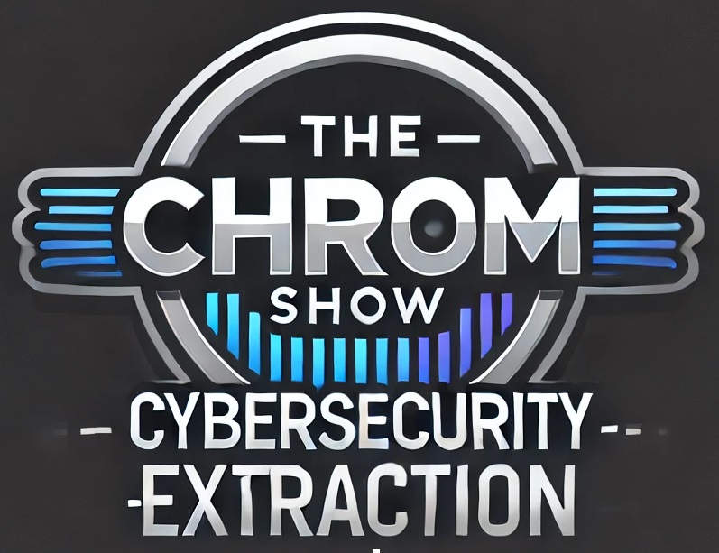

  

# TheChromShow

This project is for educational purposes to understand malware behavior and its implications for Blue Team (defensive) testing.

## Overview

TheChromShow is designed to simulate certain behaviors commonly found in malware. Specifically, it focuses on downloading and using DLLs, extracting sensitive information, and decrypting it. The project helps in understanding how such activities are performed by malicious software, enabling Blue Team members to develop more effective defense strategies.

## File Explanation

### thechromshow.cpp

This file contains the main logic of the project. Below is a breakdown of its functionality:

1. **Downloading DLLs**:
   - The `downloadDll` function downloads a DLL from a specified URL using the `URLOpenBlockingStreamA` function.
   - The `saveToFile` function saves the downloaded data to a file.

2. **Cleaning Up DLLs**:
   - The `cleanupDownloadedDlls` function unloads and deletes the `libsodium.dll` and `sqlite3.dll` files if they exist.

3. **DLL Function Pointers**:
   - The program defines function pointers for the `libsodium` and `sqlite3` libraries to use their cryptographic and database functionalities.

4. **Finding Browser Data Paths**:
   - The `FindLocalState` and `FindLoginData` functions construct paths to the Local State and Login Data files of various browsers.

5. **Extracting and Decrypting Data**:
   - The `getEncryptedKey` function extracts the encrypted key from the Local State file.
   - The `decryptKey` function decrypts the extracted key using Windows CryptoAPI.
   - The `decryptPassword` function uses `libsodium` to decrypt passwords stored in the browser's Login Data file.
   - The `loginDataParser` function reads and decrypts login data from the browser's SQLite database.

6. **Browser Search**:
   - The `browserSearch` function iterates over a list of browsers, extracting and decrypting login data from each.

7. **Main Function**:
   - The main function orchestrates the downloading of required DLLs, searching browser data, and cleaning up downloaded DLLs.

## Usage

To run this project, ensure you have an appropriate environment set up with the required libraries. The program will download the necessary DLLs, extract and decrypt login data from installed browsers, and then clean up the downloaded DLLs.

## Acknowledgements

This project acknowledges [github.com/BernKing/ChromeStealer](https://github.com/BernKing/ChromeStealer) as some code was used within this project.

## Disclaimer

This project is strictly for educational purposes. Unauthorized access or misuse of data is illegal and unethical. Always seek permission before testing on systems you do not own or control.

## Future Enhancements

This is a barebones proof of concept (PoC) for bringing the needed DLLs. Future enhancements could include searching for needed DLLs on the system instead of downloading them to disk.
